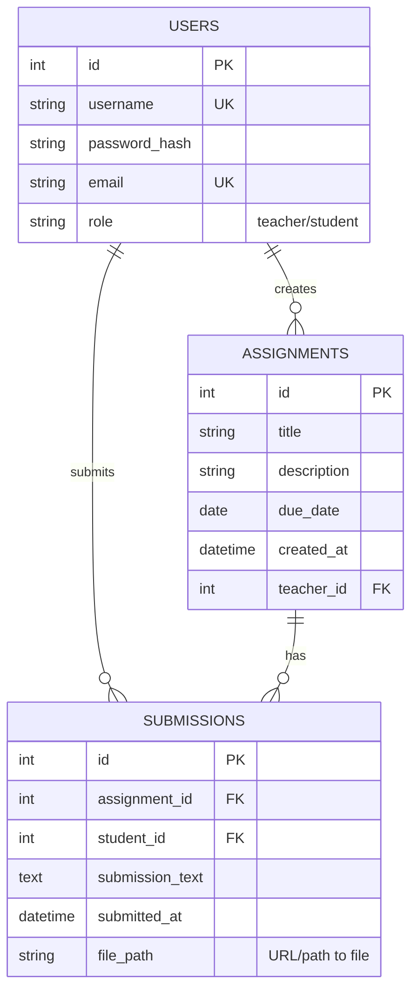

# Assignment Tracking System

## How to Run the Project

Follow these steps to run the project on your local machine:

To run the project, first get the repository onto your desktop. After downloading or cloning, open a terminal and navigate to the backend folder by running `cd backend`. Then start the backend server by running `python app.py`. Once the backend is running, go to the frontend folder and open the `index.html` file in your browser. The frontend will now work and connect to the backend.

## 1. Introduction

This document outlines the technical design and architecture of the Assignment Tracking System. The system aims to provide a platform for teachers to create and manage assignments, and for students to submit their work, including text and file uploads. It covers the core system components, data model, API specifications, authentication mechanisms, and future scalability considerations.

## 2. System Architecture

The Assignment Tracking System is built upon a **three-tier client-server architecture**, emphasizing separation of concerns, modularity, and scalability.

* **Presentation Layer (Frontend):** This layer represents the user interface, allowing teachers and students to interact with the system. It handles user input, displays retrieved data, and communicates with the backend API.
    * **Technologies:** HTML5, CSS3, JavaScript (Vanilla JS for this prototype, but extensible to frameworks like React, Vue.js, Angular).
    * **Deployment:** Served as static files via a simple HTTP server (e.g., Python's `http.server`).
* **Application Layer (Backend API):** This layer contains the core business logic, processing all requests from the frontend, performing operations, and managing data persistence. It acts as the central hub for the system's functionality.
    * **Technologies:** Python with Flask framework.
    * **Key Services:** User authentication, assignment management, submission handling (text and file uploads), and data retrieval.
* **Data Layer (Database & Storage):** This layer is responsible for the persistent storage of all application data.
    * **Technologies:** SQLite (for prototyping and local development).
    * **Data Storage:** Structured data (users, assignments, submission metadata) is stored in the database. Unstructured data (uploaded assignment files) is stored in a designated file system folder (`uploads/`).


## 3. Core Entities and Relationships

The system's data model is centered around three primary entities: `USERS`, `ASSIGNMENTS`, and `SUBMISSIONS`. These entities are interconnected through one-to-many relationships to support the core functionalities.

### Entity-Relationship (ER) Diagram




## 4\. API Endpoints

The system's backend exposes a RESTful API, utilizing standard HTTP methods and JSON for data exchange. File uploads are handled using `multipart/form-data`.

### 4.1. Authentication & User Management

  * **`POST /api/signup`**
      * **Description:** Registers a new user with either 'teacher' or 'student' role.
      * **Request Body:**
        ```json
        {
            "username": "newuser",
            "password": "strongpassword",
            "email": "user@example.com",
            "role": "student"
        }
        ```
      * **Success Response (201 Created):**
        ```json
        {
            "message": "User created successfully",
            "user_id": 1,
            "token": "eyJhbGciOiJIUzI1Ni..."
        }
        ```
      * **Error Response (400 Bad Request / 409 Conflict):**
        ```json
        {
            "message": "Username or email already exists"
        }
        ```
  * **`POST /api/login`**
      * **Description:** Authenticates an existing user and issues a JWT for subsequent authorized requests.
      * **Request Body:**
        ```json
        {
            "username": "existinguser",
            "password": "theirpassword"
        }
        ```
      * **Success Response (200 OK):**
        ```json
        {
            "message": "Login successful",
            "user_id": 1,
            "role": "student",
            "token": "eyJhbGciOiJIUzI1Ni..."
        }
        ```
      * **Error Response (401 Unauthorized):**
        ```json
        {
            "message": "Invalid credentials"
        }
        ```

### 4.2. Teacher Specific Endpoints

  * **`POST /api/assignments`**
      * **Description:** Allows an authenticated teacher to create a new assignment.
      * **Authentication:** Requires `Teacher` role.
      * **Request Body:**
        ```json
        {
            "title": "History Essay: World War I",
            "description": "Write a 500-word essay on the causes and effects of WWI.",
            "due_date": "2025-08-15"
        }
        ```
      * **Success Response (201 Created):**
        ```json
        {
            "message": "Assignment created successfully",
            "assignment_id": 101
        }
        ```
      * **Error Response (403 Forbidden):**
        ```json
        {
            "message": "Access denied. Teacher role required."
        }
        ```
  * **`GET /api/assignments/{assignment_id}/submissions`**
      * **Description:** Retrieves all submissions for a specific assignment. Accessible only by the teacher who created the assignment.
      * **Authentication:** Requires `Teacher` role.
      * **Path Parameters:** `assignment_id` (integer) - The ID of the assignment.
      * **Success Response (200 OK):**
        ```json
        [
            {
                "submission_id": 501,
                "student_id": 2,
                "student_username": "student_alice",
                "submission_text": "Here is my essay on WWI...",
                "submitted_at": "2025-08-10T14:30:00Z",
                "file_path": "uploads/20250810142958_2_essay.pdf"
            }
        ]
        ```
      * **Error Response (403 Forbidden / 404 Not Found):**
        ```json
        {
            "message": "Assignment not found or you don't have permission to view submissions for this assignment"
        }
        ```

### 4.3. Student Specific Endpoints

  * **`POST /api/assignments/{assignment_id}/submit`**
      * **Description:** Allows an authenticated student to submit for a specific assignment. Supports both text-based submissions and file uploads.
      * **Authentication:** Requires `Student` role.
      * **Path Parameters:** `assignment_id` (integer) - The ID of the assignment to submit to.
      * **Request Body:** `multipart/form-data` (preferred for file uploads)
          * `submission_text` (form field): Optional text content for the submission.
          * `file` (form field): Optional file attachment.
      * **Success Response (201 Created):**
        ```json
        {
            "message": "Assignment submitted successfully",
            "submission_id": 503
        }
        ```
      * **Error Response (409 Conflict):**
        ```json
        {
            "message": "You have already submitted for this assignment."
        }
        ```
## 5. Authentication Strategy (Roles: Student vs. Teacher)

| **Role**   | **Access Level**                                                                 | **Permissions**                                                                 |
|------------|---------------------------------------------------------------------------------|---------------------------------------------------------------------------------|
| **Student** | Basic user authentication (email/roll no + password).                          | - View and submit assignments<br>- View teacher feedback<br>- Update own profile |
| **Teacher** | Elevated authentication (email/employee ID + password with 2FA optional).      | - Create and manage assignments<br>- View all student submissions<br>- Update grades and feedback |


---

## 6. Scalability Suggestions (Future Plans)

To scale this system for larger usage and better performance, the following plans can be implemented:

- **Role-Based Access Control (RBAC)** – Enhance security by adding granular permissions for different teacher/student levels.  
- **Load Balancing & Caching** – Use a caching layer (like Redis) and load balancers to improve performance for high traffic.  
- **Pagination & Lazy Loading** – Implement pagination for viewing assignments/submissions instead of fetching all at once.  
- **Search & Filtering** – Add search functionality for quick filtering of assignments or students.  
- **Cloud Deployment** – Host the web app on cloud platforms (AWS, Azure, or GCP) for high availability.  
- **API Rate Limiting** – Prevent abuse of APIs by adding throttling and rate-limiting.  
- **Microservices Architecture** – Break the application into smaller services for better scalability.  
- **Notifications System** – Real-time notifications using WebSockets or Firebase for assignment updates.  

---

